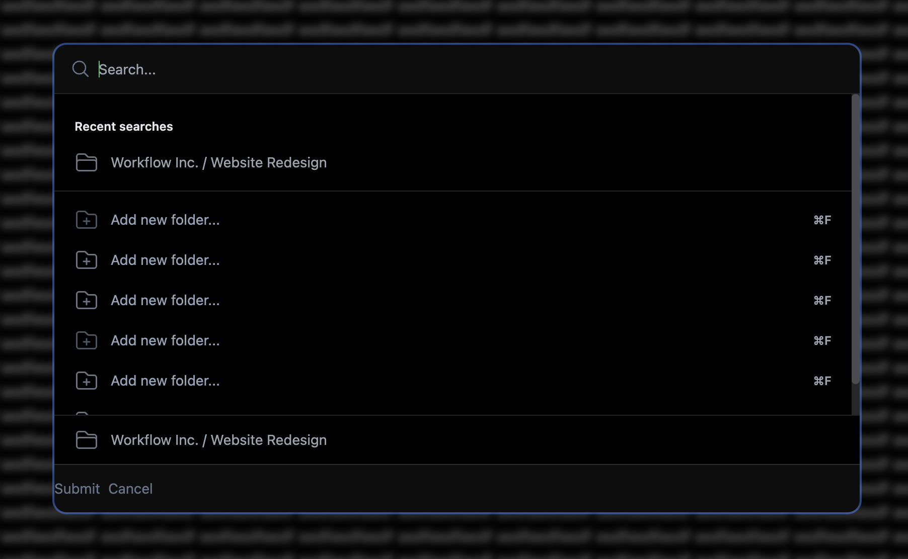

# Svelte 5 Command Palette



## Install

```bash
npm install @mateothegreat/svelte5-command-palette
```

## Development

First, clone the repo:

```sh
git clone https://github.com/mateothegreat/svelte5-command-palette.git
```

Now `cd svelte5-command-palette` and run:

```sh
make test
```

This will install dependencies and run the test app in watch mode.
